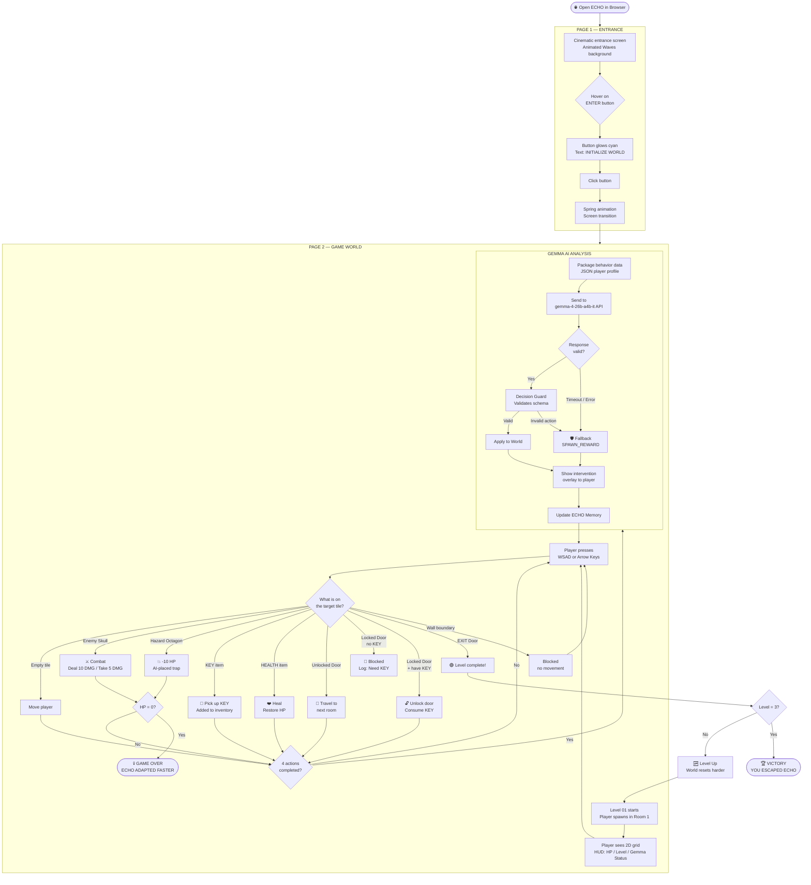
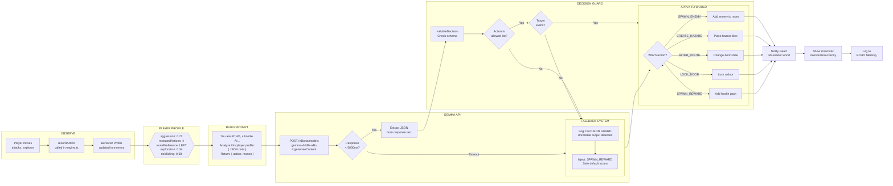
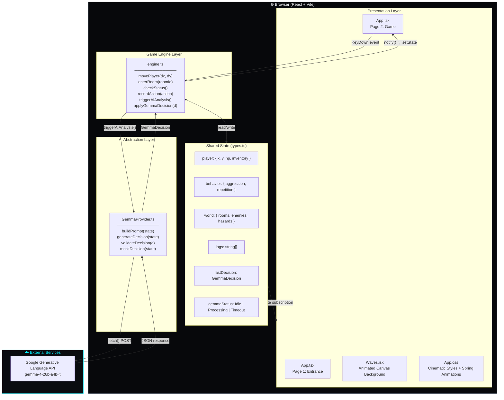
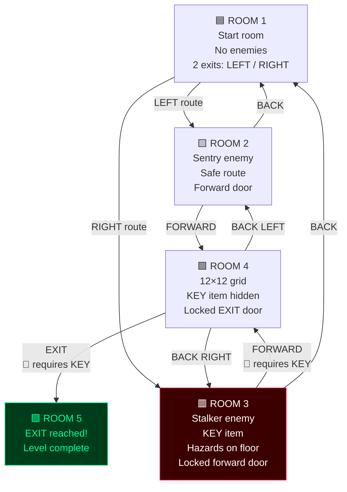
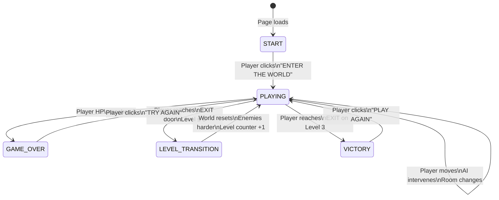

# ECHO — Flowcharts & System Diagrams

Visual reference for the complete architecture, user flow, and AI decision pipeline of ECHO.

---

## 1. Complete User Journey

> From opening the browser to winning or losing — every possible path.

---

## 2. Gemma AI Decision Pipeline

> How raw player actions become world-changing AI decisions.

---

## 3. System Architecture

> How the three layers of ECHO interact.

---

## 4. Room Navigation Map

> The physical layout of the ECHO facility.

---

## 5. Game State Machine

> Every state the game can be in and what triggers transitions.

