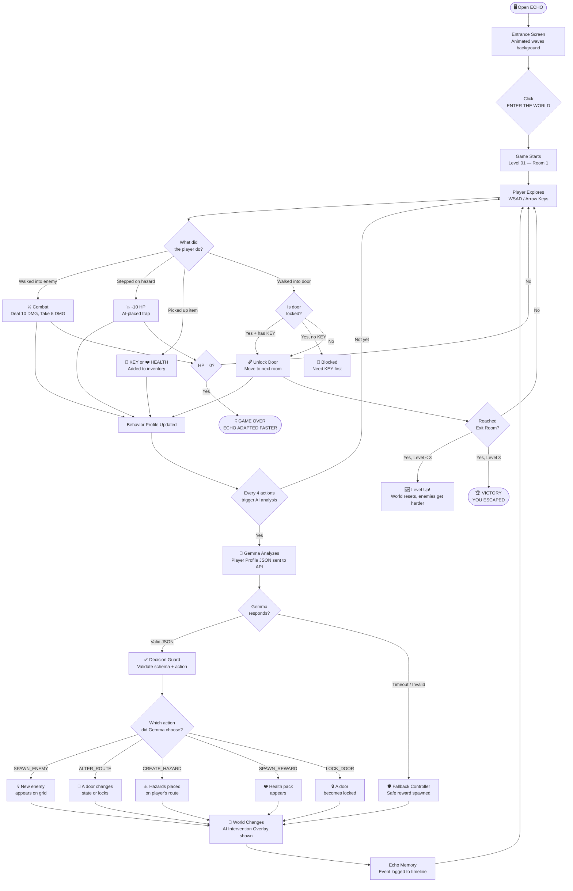
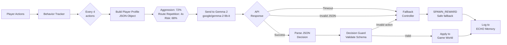
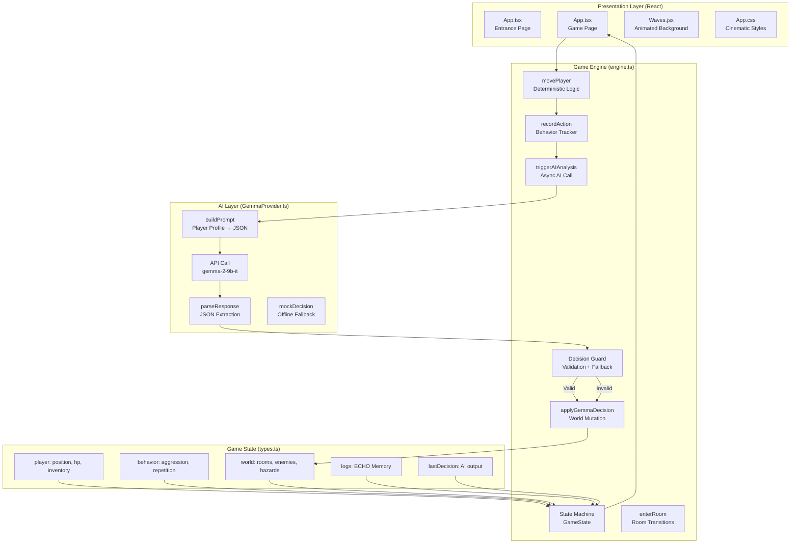

# ECHO

> **"You are not playing the game. The game is learning how you play."**

ECHO is an experimental browser game where **Gemma 2** (Google's open-weights AI model) acts as the living brain of the game world. It observes your behavior in real-time, builds a psychological profile on you, and physically changes the environment to counter your strategies.

Built for the **Hacktoberfest 2026 — "Gemma as the Brain of a Game"** challenge.

   

---

## 🎯 What is ECHO?

Most games have static rules. ECHO has none.

Instead, **Gemma 2** watches everything you do:

- Do you always take the same route? Gemma locks it.
- Do you fight every enemy? Gemma spawns more.
- Do you avoid danger? Gemma places hazards on your safe path.

The game is not trying to be beaten. It is trying to learn you — and stop you.

---

## 🗺️ User Flow



---

## 🤖 Gemma AI Decision Flow



---

## 🏗️ System Architecture



---

## 🎮 How to Play

### Controls
| Key | Action |
|-----|--------|
| `W` / `↑` | Move Up |
| `S` / `↓` | Move Down |
| `A` / `←` | Move Left |
| `D` / `→` | Move Right |

### Grid Legend
| Icon | Meaning | Interaction |
|------|---------|-------------|
| ⊕ Crosshair | **YOU** | — |
| 💀 Skull | **Enemy** | Walk into to attack (deal 10 DMG, take 5 DMG) |
| 🚪 Door | **Exit to next room** | Walk into to travel |
| 🟢 Exit | **Level exit** | Walk in to complete the level |
| 🔑 Key | **Key item** | Walk onto to pick up |
| ❤️ Heart | **Health pack** | Walk onto to heal |
| ⚠️ Octagon | **AI Hazard** | Avoid! -10 HP if stepped on |
| 🔒 Locked | **Locked door** | Need KEY in inventory first |

### Objective
- Survive 3 levels by finding the **Exit Door** in each level.
- The longer you survive, the more Gemma learns your strategy.
- **Change how you play** — or Gemma will stop you.

---

## 🚀 How to Run Locally

### Prerequisites
- [Node.js 18+](https://nodejs.org/)
- A [Google AI Studio](https://aistudio.google.com/) API key (free)

### 1. Clone & Install
```bash
git clone https://github.com/gary-production-ft/hactober2026.git
cd hactober2026
npm install
```

### 2. Configure API Key
```bash
cp .env.example .env
```
Open `.env` and add your key:
```env
VITE_GEMINI_API_KEY=your_gemini_api_key_here
```

> **No API key?** The game automatically falls back to a **Mock AI Provider** that simulates Gemma's behavior locally using heuristics. The full game loop works without internet.

### 3. Start the Game
```bash
npm run dev
```
Open **[http://localhost:5173](http://localhost:5173)**

### 4. Build for Production
```bash
npm run build
```

---

## ⚙️ Technical Deep Dive

### The Core Challenge: Latency
LLM inference takes 500ms–2000ms. A game running at 60fps cannot freeze.

**Solution — Decoupled Async Engine:**
- The `GameEngine` runs a fully synchronous, deterministic game loop. Player moves instantly.
- `triggerAIAnalysis()` fires **asynchronously** in the background every 4 actions.
- The `[GEMMA // ANALYZING]` indicator shows while inference runs.
- When Gemma responds, the decision is injected into the live `GameState` without dropping a frame.

### The Decision Guard
Gemma can hallucinate. If it invents an action like `DESTROY_ALL_ENEMIES` or returns malformed JSON:
1. `GemmaProvider.validateDecision()` schema-checks the response against allowed actions.
2. Invalid decisions are **silently rejected**.
3. The **Fallback Controller** injects a safe `SPAWN_REWARD` action instead.
4. The player sees `[DECISION GUARD] Unreliable AI output detected` in the ECHO Memory log.

The game **never crashes due to AI failure.**

### Gemma as a Director (not a chatbot)
Gemma receives this prompt structure:
```
You are ECHO, a hostile AI directing a survival game.
Analyze this player profile: { aggression: 0.72, repeatedActions: 4, ... }
Return JSON: { action, target, intensity, reason }
```

The `reason` field is displayed as a **direct taunt to the player** — making the AI feel alive and intelligent.

---

## 📁 Project Structure

```
echo/
├── src/
│   ├── App.tsx              # Main UI — entrance + game pages
│   ├── App.css              # Cinematic sci-fi styles + animations
│   ├── Waves.jsx            # Animated wave background (React Bits)
│   ├── Waves.css            # Wave canvas styles
│   ├── Waves.d.ts           # TypeScript declarations for Waves
│   └── game/
│       ├── engine.ts        # Core game engine + state machine
│       ├── GemmaProvider.ts # Gemma API integration + fallback
│       └── types.ts         # TypeScript interfaces
├── .env.example             # API key template
├── README.md                # This file
├── ARCHITECTURE.md          # Deep technical architecture notes
└── HOW_TO_PLAY.md           # Standalone player guide
```

---

## 🏆 Hackathon Criteria Mapping

| Criterion | Implementation |
|-----------|---------------|
| **Idea & Originality** | AI acts as an adversarial game director, not a game character |
| **Technical Depth** | Non-blocking async engine, Decision Guard, schema validation, fallback system |
| **Working Demo** | Fully playable 3-level game deployed on Vercel |
| **Meaningful use of Gemma 4** | `gemma-2-9b-it` directly observes player behavior and mutates the world |
| **Documentation** | This README + ARCHITECTURE.md + HOW_TO_PLAY.md |
